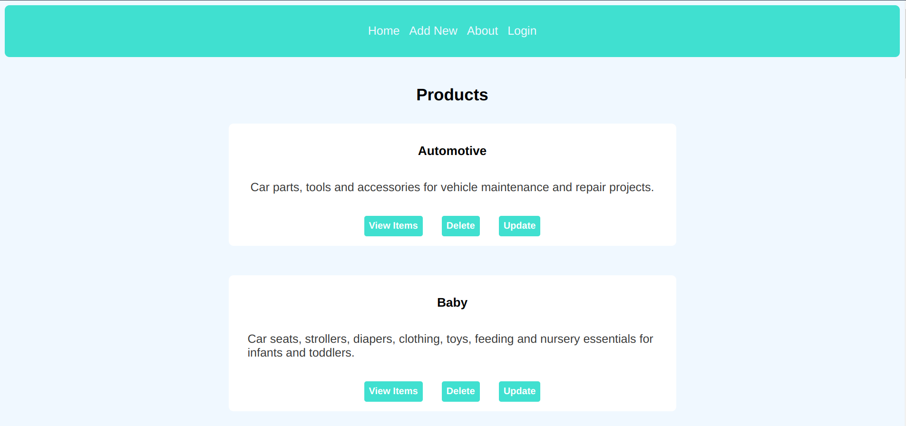
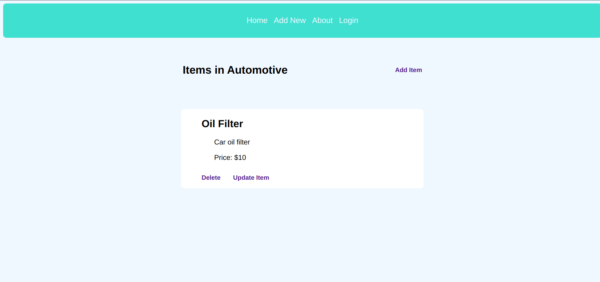
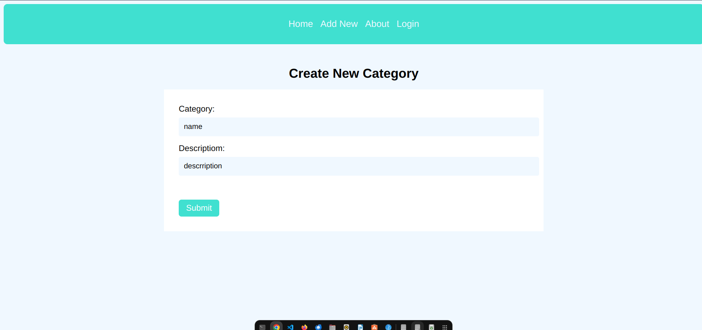
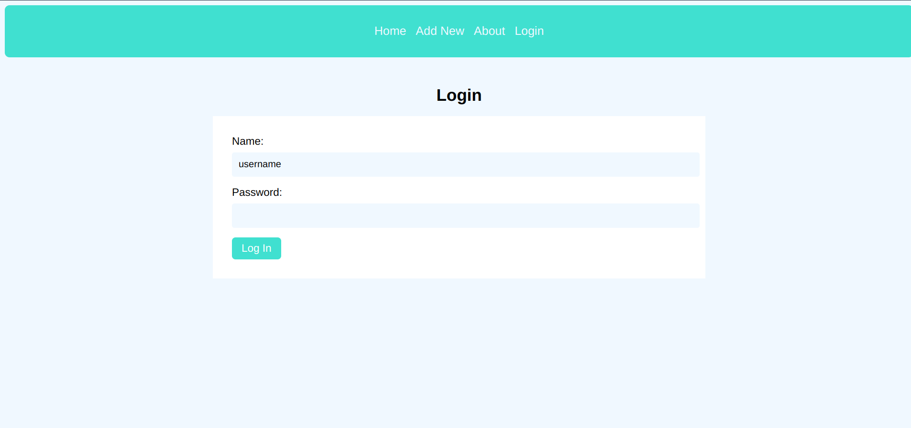

# Inventory Application

## Overview

Welcome to the Inventory Application, an Express app. This app serves as an Inventory management system for an imaginary store, allowing users to categorize and manage items seamlessly. Whether you are selling groceries, car parts, baby toys, or anything else, this app provides a robust solution for your inventory needs.










## Technologies Used

- **Node.js:** The backend of the application is built on Node.js, providing a scalable and efficient server environment.

- **Express.js:** The app utilizes Express.js as the web application framework for Node.js, streamlining the development of robust and scalable APIs.

- **MongoDB:** MongoDB serves as the database for the application, offering a flexible and scalable NoSQL data storage solution.

- **Mongoose:** Mongoose is employed as an ODM (Object Data Modeling) library for MongoDB and Node.js, simplifying the interaction with the MongoDB database.

- **Pug (formerly Jade):** Pug is used as the templating engine to generate dynamic HTML views for the application, enhancing code readability and maintainability.

## Features

- **Categories and Items:** The app allows users to create, read, update, and delete both categories and items. **Update:** Only admins can delete and update an item or a category.
- **CRUD Operations:** All CRUD (Create, Read, Update, Delete) operations are supported for items and categories.
- **Intuitive Navigation:** Users can easily navigate through categories and view corresponding items on the home page.
- **Database Integration:** MongoDB is used as the database, with schemas and models defining the structure of categories and items.
- **Templating Language:** The app utilizes a templating language(Pug) to generate dynamic views and provide a smooth user experience.

## Getting Started

1. **Clone the Repository:**
   ```bash
   git clone https://github.com/Uwancha/Inventory-App.git
   ```

2. **Install Dependencies:**
   ```bash
   cd inventory-application
   npm install
   ```

3. **Configure MongoDB:**
   Set up your MongoDB database and configure the connection details in the `.env` file.

4. **Run the Application:**
   ```bash
   npm start
   ```

5. **Access the App:**
   Open your browser and navigate to [http://localhost:3000](http://localhost:3000).

## Project Structure

- **models/:** Contains database schemas and models.
- **views/:** Includes templates for rendering views.
- **routes/:** Defines routes for different app functionalities.
- **controllers/:** Manages business logic for handling requests.
- **public/:** Stores static files (stylesheets).
- **app.js:** Entry point of the application.

## Contributing

Contributions are welcome! If you have ideas for improvements, please fork the project, make your changes, and submit a pull request. If you encounter any issues, feel free to open an [issue](https://github.com/Uwancha/Inventory-App/issues).

## License

This project is licensed under the MIT License - see the [LICENSE.md](LICENSE.md) file for details.

## Acknowledgments

- The Odin Project for providing the NodeJS course and valuable guidance.
